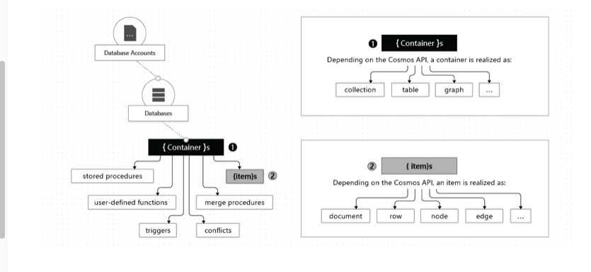

### What are the possible containers inside Azure ? ###


## Source code ##
 ```java
 package cosmos.db.util;

import com.azure.cosmos.*;
import com.azure.cosmos.models.CosmosContainerProperties;
import com.azure.cosmos.models.CosmosContainerResponse;
import com.azure.cosmos.models.CosmosDatabaseResponse;
import com.azure.cosmos.models.ThroughputProperties;

import java.util.Collections;

public class CosmosDbHandler {

    private CosmosClient client=null;

    private final String databaseName = "SampleDb";
    private final String containerName = "SampleContainer";

    private CosmosDatabase database=null;
    private CosmosContainer container=null;

    private String hostName;
    private String hostKey;

    public CosmosDbHandler(String hostName, String hostKey) {
        this.hostName = hostName;
        this.hostKey = hostKey;
    }

    private void createClient() throws Exception {
        System.out.println("Using Azure Cosmos DB endpoint: " + hostName);

        client = new CosmosClientBuilder()
                .endpoint(hostName)
                .key(hostKey)
                .preferredRegions(Collections.singletonList("Canada Central"))
                .consistencyLevel(ConsistencyLevel.EVENTUAL)
                .buildClient();


        createDatabaseIfNotExists();
        createContainerIfNotExists();

    }

    private void createDatabaseIfNotExists() throws Exception {
        System.out.println("Create database " + databaseName + " if not exists.");
        CosmosDatabaseResponse cosmosDatabaseResponse = client.createDatabaseIfNotExists(databaseName);
        database = client.getDatabase(cosmosDatabaseResponse.getProperties().getId());
        System.out.println("Checking database " + database.getId() + " completed!\n");
    }

    private void createContainerIfNotExists() throws Exception {
        System.out.println("Create container " + containerName + " if not exists.");
        CosmosContainerProperties containerProperties =
                new CosmosContainerProperties(containerName, "/lastName");

        CosmosContainerResponse cosmosContainerResponse =
                database.createContainerIfNotExists(containerProperties, ThroughputProperties.createManualThroughput(400));
        container = database.getContainer(cosmosContainerResponse.getProperties().getId());

        System.out.println("Checking container " + container.getId() + " completed!\n");
    }

    public CosmosContainer getCosmosContainer() throws Exception {
        if(container==null){
            createClient();
            createContainerIfNotExists();
        }
        return container;
    }
}
```

```java
package cosmos.db.util;

public class CosmosDbProperties {
    public static final String AZURE_HOST_NAME="";
    public static final String AZURE_KEY="";
}
```

```java
package model;

public class Address {
    private String streetName;
    private String postalCode;

    public String getStreetName() {
        return streetName;
    }

    public void setStreetName(String streetName) {
        this.streetName = streetName;
    }

    public String getPostalCode() {
        return postalCode;
    }

    public void setPostalCode(String postalCode) {
        this.postalCode = postalCode;
    }
}
```

```java
package model;

public class Customer {
    private String id;
    private String firstName;
    private Address address;

    public String getId() {
        return id;
    }

    public void setId(String id) {
        this.id = id;
    }

    public String getFirstName() {
        return firstName;
    }

    public void setFirstName(String firstName) {
        this.firstName = firstName;
    }

    public Address getAddress() {
        return address;
    }

    public void setAddress(Address address) {
        this.address = address;
    }
}
```

```java
import com.azure.cosmos.CosmosContainer;
import com.azure.cosmos.models.CosmosItemRequestOptions;
import com.azure.cosmos.models.CosmosItemResponse;
import com.azure.cosmos.models.PartitionKey;
import cosmos.db.util.CosmosDbHandler;
import cosmos.db.util.CosmosDbProperties;
import model.Address;
import model.Customer;

import java.util.UUID;

public class CosmosDbNexusController {
    public static void main(String[] args) throws Exception {

        CosmosItemRequestOptions cosmosItemRequestOptions = new CosmosItemRequestOptions();

        //Get Cosmos DB container by injecting hostname and key
        CosmosDbHandler cosmosDbHandler=new CosmosDbHandler(CosmosDbProperties.AZURE_HOST_NAME,CosmosDbProperties.AZURE_KEY);
        CosmosContainer cosmosContainer= cosmosDbHandler.getCosmosContainer();


        //Set Customer
        Address address=new Address();
        address.setStreetName("101 St Nw. Edmonton");
        address.setPostalCode("M1ZM1KLLM");

        Customer customer=new Customer();
        customer.setFirstName(UUID.randomUUID().toString());
        customer.setAddress(address);


        CosmosItemResponse<Customer> item = cosmosContainer.createItem(customer, new PartitionKey(customer.getId()), cosmosItemRequestOptions);

        System.out.println(String.format("Created item with request charge of %.2f within" +
                        " duration %s",
                item.getRequestCharge(), item.getDuration()));

    }
}
```

## References ## 
