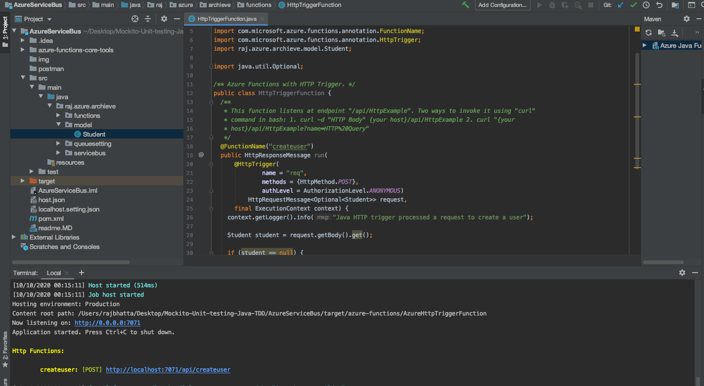
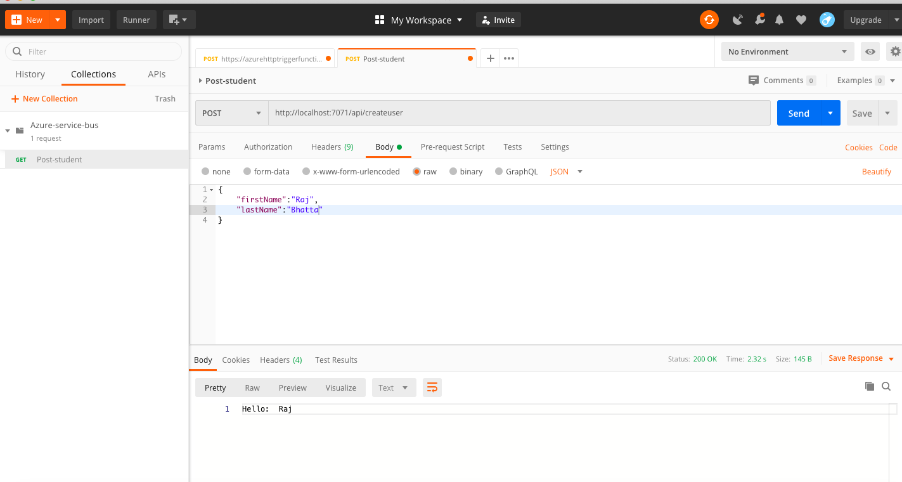
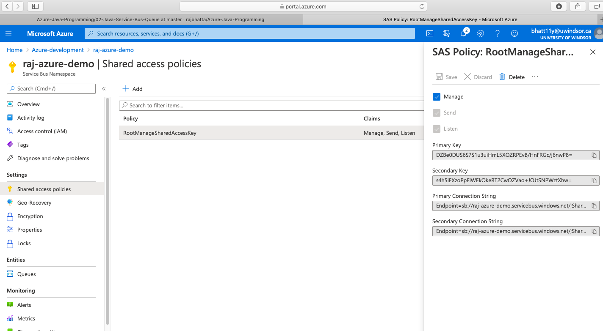
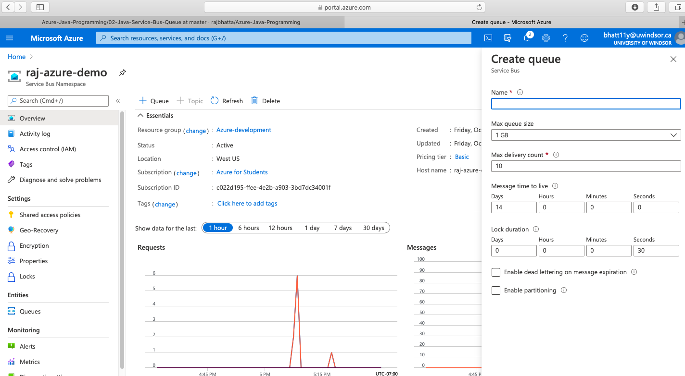

## How to handle Azure functions ? ##

### 1. To Deploy to Azure portal ###
- mvn clean install package azure-functions:deploy

### 2. To run locally ###
- mvn package azure-functions:run

### 3. To debug Azure function locally ###
- mvn package azure-functions:run - DenableDebug

## Running project locally using IntelliJ IDE ##
- goto terminal and type mvn package azure-functions:run
- You will have link as given below:


## Sending data from postman to Azure function ##



## How to create Azure Service Bus Namespace and get connection string? ##
- Goto Azure portal
- Opened resource group that you created. If you don't have resource group create one
- Click on Add -> search for service bus and click on create
- Once Servicebus namespace is created, click on shared access policies as given below:

-Select connectionstring

## How to create queue inside Azure Service Bus Namespace ? ##
- Go inside namespace that you created in above step
- click on add then you will have option as given below:



## Code details ##
#### 1. HttpTrigger Azure function ####
```java
package raj.azure.archieve.azurefunction;

import com.google.common.base.Optional;
import com.microsoft.azure.functions.*;
import com.microsoft.azure.functions.annotation.AuthorizationLevel;
import com.microsoft.azure.functions.annotation.FunctionName;
import com.microsoft.azure.functions.annotation.HttpTrigger;
import raj.azure.archieve.azurefunctionservice.HttpTriggerFunctionService;
import raj.azure.archieve.model.Student;
import raj.azure.archieve.queuesetting.MultipleQueueSetting;
import raj.azure.archieve.queuesetting.QueueSetting;

/** Azure Functions with HTTP Trigger. */
public class HttpTriggerFunction {
  /**
   * This function listens at endpoint "/api/HttpExample". Two ways to invoke it using "curl"
   * command in bash: 1. curl -d "HTTP Body" {your host}/api/HttpExample 2. curl "{your
   * host}/api/HttpExample?name=HTTP%20Query"
   */
  @FunctionName("createuser")
  public HttpResponseMessage run(
      @HttpTrigger(
              name = "req",
              methods = {HttpMethod.POST},
              authLevel = AuthorizationLevel.ANONYMOUS)
              HttpRequestMessage<Optional<Student>> request,
      final ExecutionContext context) {
    context.getLogger().info("Java HTTP trigger processed a request to create a user");

    Student student = request.getBody().get();

    if (student == null) {
      return request
          .createResponseBuilder(HttpStatus.BAD_REQUEST)
          .body("Please provider student info")
          .build();
    } else {

      provideHttpTriggerFunctionService(context,student);

      return request
          .createResponseBuilder(HttpStatus.OK)
          .body("Hello: \t" + student.getFirstName())
          .build();
    }
  }

  private HttpTriggerFunctionService provideHttpTriggerFunctionService(ExecutionContext executionContext, Student student){
    return new HttpTriggerFunctionService(executionContext,student,provideQueueSetting());
  }

  private QueueSetting provideQueueSetting(){
    return new MultipleQueueSetting();
  }
}

```

#### 2. Service Bus Queue Client Handler ####
```java
package raj.azure.archieve.servicebus;

import com.microsoft.azure.servicebus.Message;
import com.microsoft.azure.servicebus.QueueClient;
import com.microsoft.azure.servicebus.ReceiveMode;
import com.microsoft.azure.servicebus.primitives.ConnectionStringBuilder;
import com.microsoft.azure.servicebus.primitives.ServiceBusException;
import raj.azure.archieve.exception.AzureServiceBusException;

public class AzureServiceBusClient {
  private String serviceBusNamespaceConnectionString;
  private String queueName;
  private QueueClient queueClient;

  //This helps to perform unit testing
  public AzureServiceBusClient(QueueClient queueClient) {
    this.queueClient = queueClient;
  }

  public AzureServiceBusClient(String serviceBusNamespaceConnectionString, String queueName) {
    this.serviceBusNamespaceConnectionString = serviceBusNamespaceConnectionString;
    this.queueName = queueName;
  }


  public QueueClient createQueueClient() throws AzureServiceBusException {
    if (queueClient == null) {
      try {
        queueClient =
            new QueueClient(
                new ConnectionStringBuilder(serviceBusNamespaceConnectionString, queueName),
                ReceiveMode.PEEKLOCK);
      } catch (InterruptedException e) {
       throw new AzureServiceBusException("InterruptedException",e);
      } catch (ServiceBusException e) {
        throw new AzureServiceBusException("ServiceBusException",e);
      }
    }
    return queueClient;
  }

  public void sendMessage(Message message){
    queueClient.sendAsync(message);
  }

  public void closeConnection() throws AzureServiceBusException {
    if(queueClient!=null){
      try {
        queueClient.close();
      } catch (ServiceBusException e) {
        throw new AzureServiceBusException("Error closing service bus connection",e);
      }
    }
  }


}

```

#### 3. Generic Queue Service ####
```java
package raj.azure.archieve.servicebus;

import raj.azure.archieve.exception.AzureServiceBusException;
import raj.azure.archieve.exception.ServiceBusHandlerException;

public interface QueueService<T> {
   void sendMessage(T t) throws AzureServiceBusException, ServiceBusHandlerException;
}

```

#### 4. Generic queue service impl ####
```java
package raj.azure.archieve.servicebus;

import com.fasterxml.jackson.core.JsonProcessingException;
import com.fasterxml.jackson.databind.ObjectMapper;
import com.microsoft.azure.servicebus.Message;
import com.microsoft.azure.servicebus.QueueClient;
import raj.azure.archieve.exception.AzureServiceBusException;
import raj.azure.archieve.exception.ServiceBusHandlerException;

import java.time.Duration;
import java.util.UUID;

public class QueueServiceImpl<T> implements QueueService<T> {

  AzureServiceBusClient azureServiceBusClient;

  public QueueServiceImpl(AzureServiceBusClient azureServiceBusClient) {
    this.azureServiceBusClient = azureServiceBusClient;
  }

  @Override
  public void sendMessage(T t) throws AzureServiceBusException, ServiceBusHandlerException {
    QueueClient queueClient=azureServiceBusClient.createQueueClient();
    Message message=prepareMessage(t);
    queueClient.sendAsync(message);
    azureServiceBusClient.closeConnection();
  }
  private Message prepareMessage(T t) throws ServiceBusHandlerException {
    try {
      String stringMessageBody=  provideObjectMapper().writeValueAsString(t);
      Message message = new Message(stringMessageBody);
      message.setContentType("test/plain");
      message.setLabel(UUID.randomUUID().toString());
      message.setMessageId(UUID.randomUUID().toString());
      message.setTimeToLive(Duration.ofMinutes(10));
      return message;
    } catch (JsonProcessingException e) {
      throw new ServiceBusHandlerException("JsonProcessingException",e);
    }

  }
  private ObjectMapper provideObjectMapper(){
    return new ObjectMapper();
  }

}

```

#### 5. Injector between Azure function and service bus queue ####
```java
package raj.azure.archieve.azurefunctionservice;

import com.microsoft.azure.functions.ExecutionContext;
import raj.azure.archieve.exception.AzureServiceBusException;
import raj.azure.archieve.exception.ServiceBusHandlerException;
import raj.azure.archieve.model.Student;
import raj.azure.archieve.queuesetting.QueueSetting;
import raj.azure.archieve.servicebus.AzureServiceBusClient;
import raj.azure.archieve.servicebus.QueueService;
import raj.azure.archieve.servicebus.QueueServiceImpl;

public class HttpTriggerFunctionService {
  ExecutionContext executionContext;
  Student student;
  QueueSetting queueSetting;


  public HttpTriggerFunctionService(
      ExecutionContext executionContext,
      Student student,
      QueueSetting queueSetting) {
    this.executionContext = executionContext;
    this.student = student;
    this.queueSetting = queueSetting;
  }

  public void sendMessageToQueue() throws AzureServiceBusException, ServiceBusHandlerException {
    String queueName = student.getQueueName();
    QueueService<Student> studentQueueService=provideStudentQueueService(queueName);
    studentQueueService.sendMessage(student);
  }

  private AzureServiceBusClient azureServiceBusClient(String queueName){
      return new AzureServiceBusClient(queueSetting.provideServiceBusString(),queueName);
  }

  private QueueService<Student> provideStudentQueueService(String queueName){
      return new QueueServiceImpl<>(azureServiceBusClient(queueName));
  }

}
```

#### 6. Environment setting ####
```java
package raj.azure.archieve.queuesetting;

public interface QueueSetting {
  String provideServiceBusString();

  String provideFirstQueName();

  String provideSecondQueueName();
}

```

#### 7. Environment setting details ####
```java
package raj.azure.archieve.queuesetting;

public class MultipleQueueSetting implements QueueSetting {
  @Override
  public String provideServiceBusString() {
    return System.getenv("SERVICE-BUS-CONNECTION-STRING");
  }

  @Override
  public String provideFirstQueName() {
    return System.getenv("FIRST-QUEUE-NAME");
  }

  @Override
  public String provideSecondQueueName() {
    return System.getenv("SECOND-QUEUE-NAME");
  }
}

```