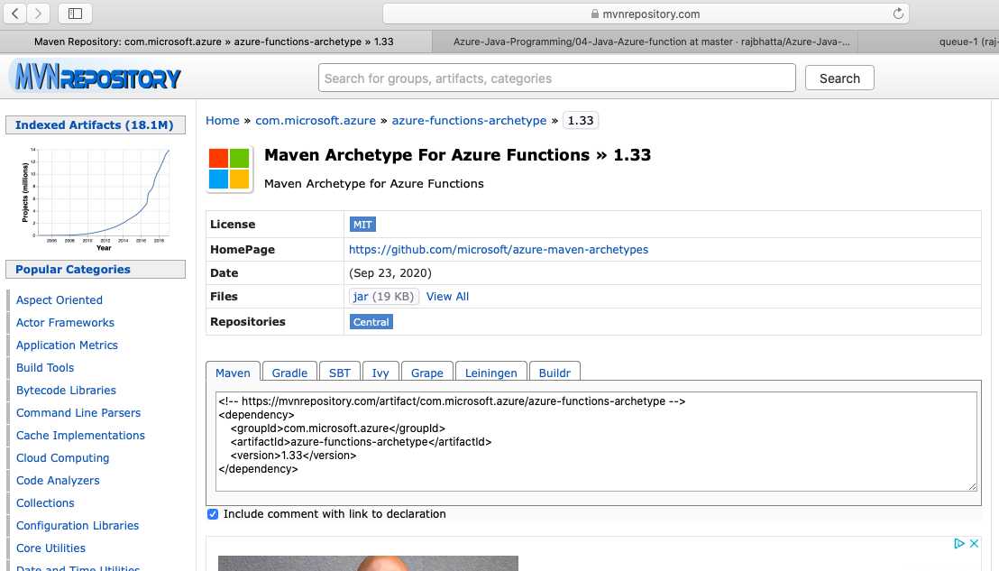
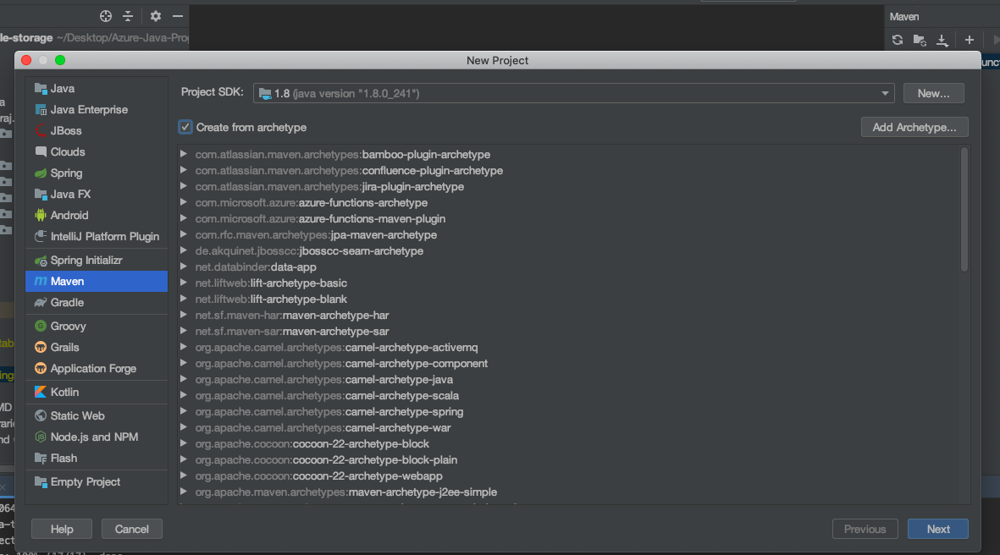
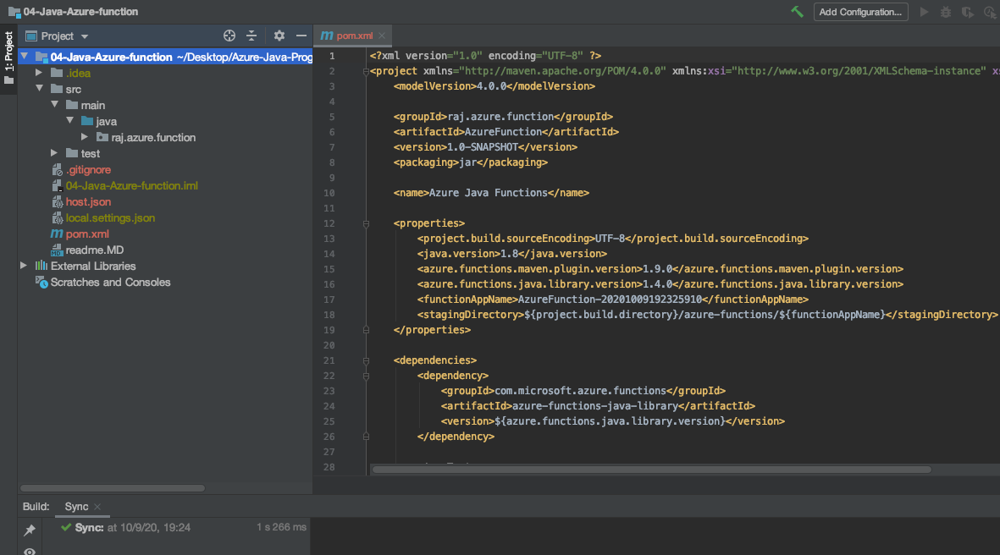
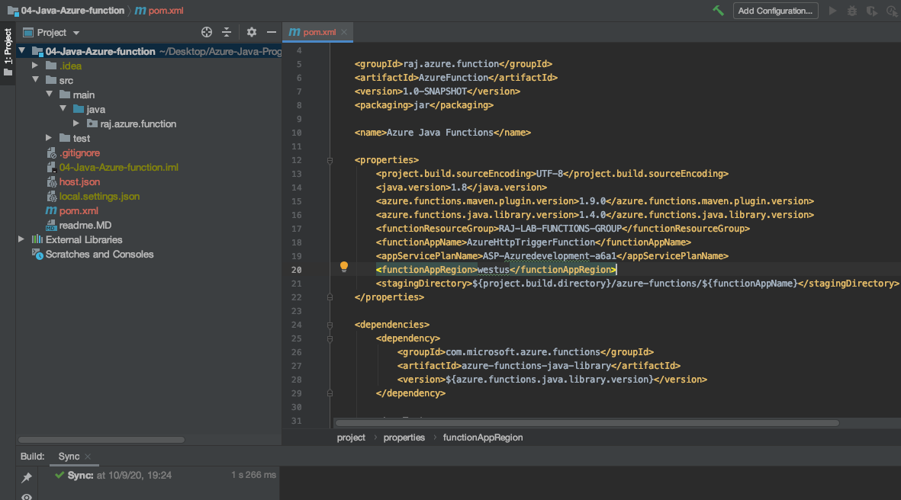
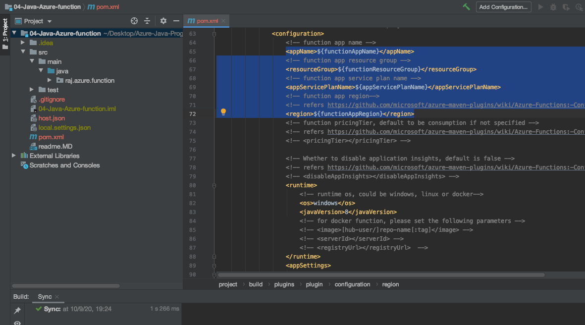

## How to create Azure function in Java ##
#### 1. Find proper archtype from the internet ####

#### 2. Create maven project but check create from archtype and add information from step 1s ####

#### 3. Locate azure properties ####

#### 4. Add Azure properties ####

#### 5. Update Azure properties ####

## How to handle  Azure functions ? ##

### 1. To Deploy to Azure portal ###
- mvn clean install package azure-functions:deploy

### 2. To run locally ###
- mvn package azure-functions:run

### 3. To debug Azure function locally ###
- mvn package azure-functions:run - DenableDebug

## Types of Azure function ##
1. Http Trigger Azure function
2. Time trigger Http function
3. Queue trigger Http function
